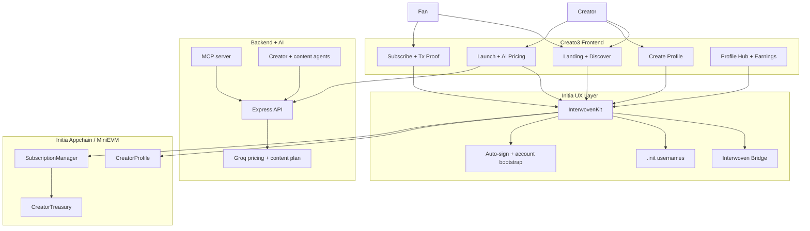

# Creato3 Architecture

## System Diagram

## Reading Guide

1. `CreateProfilePage` creates creator identity on-chain through `CreatorProfile`.
2. `LaunchPage` combines uploads, audience size, links, and AI pricing, then writes the tier on-chain.
3. `CreatorPage` reads on-chain profile/tier state and local launch metadata.
4. `SubscribePage` sends the subscription transaction and now surfaces a verification hash for the demo.
5. `ProfilePage` acts as the creator/fan hub for history, receipts, and treasury-related proof.

## Verification Story

- Profile creation returns a transaction hash.
- Launching or updating a tier returns a transaction hash.
- Subscription payment returns a transaction hash.
- When `VITE_TX_EXPLORER_BASE_URL` is configured, the UI can deep-link those proofs to Initia scan.
